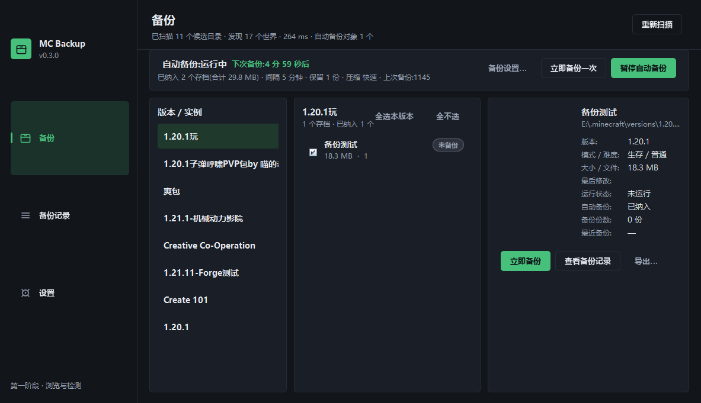

# mcBack

**由 DeepSeek 开发的 Minecraft Java 版存档自动备份工具 —— 完全独立、极致低占用。**

它是一个**独立小工具**:既不是 Mod,也不是启动器,不注入游戏进程、不改游戏文件、不需要任何额外组件;
同时它把「占用低」当成硬指标:空闲时几乎不耗 CPU,备份 GB 级世界也不会出现内存暴涨。

## 为什么说它「独立」

- **不是 Mod、不是启动器**:不注入游戏进程、不修改游戏文件、不要求安装任何 Mod 或组件
- **不需要装 Java**:免安装版内置裁剪过的 Java 运行时(46 MB),双击即用;安装版按用户安装,不需要管理员
- **不依赖任何外部软件**:不需要 VC++ 运行库、不需要数据库、不需要 Python / Node、不需要配置 JAVA_HOME
- **不联网、不需要服务器**:全部数据都在本地,不注册、不上传、不收集
- **原版和模组整合包通吃**:只通过文件系统观察存档目录,不关心你用什么启动器、装了什么 Mod

## 为什么说它「低占用」

| 指标 | 实测 |
| --- | --- |
| 空闲 CPU | **接近 0%**——三个后台线程都在等待,没有轮询;界面只在「备份」页可见且自动备份运行时才每秒刷新倒计时 |
| 内存 | 备份 **454 MB** 世界时峰值堆内存 **33.7 MB**(把堆上限设成 128 MB 也能跑完);空闲常驻约 74 MB |
| 磁盘活动 | 只在存档**确实发生变化**时才复制文件;世界大小按「路径 + 修改时间指纹」缓存,不重复扫描 |
| 备份耗时 | 454 MB 世界约 **5.9 秒**;291 MB 整合包世界约 7.0 秒;11.5 MB 世界 0.3 秒 |
| 体积 | 整个免安装目录 **47 MB**(其中 Java 运行时 46 MB,程序本体 0.2 MB) |
| 并发 | 单实例运行,不会出现两个进程抢同一个世界;备份/导出/恢复串行执行,避免磁盘抖动 |

具体做法:自绘 Swing 界面(不引入任何 UI 框架)、按需裁剪 Java 运行时、流式读写(代码里没有
`Files.readAllBytes` 处理大文件)、区域文件采样试压(压不动的直接存储,把 454 MB 世界的备份时间从 15 秒压到 6 秒)、
没有常驻动画与轮询。

## 功能一览

- 游戏**正在运行**时也能备份(用文件变化检测 + 重试,而不是要求你先退出)
- **只备份你勾选的存档**,不勾的绝不碰
- 主界面就是自动备份主控台:状态、**下次备份倒计时**、开始/暂停
- 备份是带清单的 ZIP,支持校验(SHA-256)、恢复、导出、按份数自动清理

开发者:**wumuji** · 许可证:[MIT](LICENSE) · 项目主页:https://github.com/wumuji/mcBack

## 快速开始

1. 到 Releases 下载 **`mcBack-1.0.0-portable.zip`**(免安装)或 **`mcBack-1.0.0-Setup.exe`**(安装版)。
2. 免安装版:解压到任意目录,双击 **`mcBack.exe`**。
3. 打开后会自动找到你的存档。在中间列表里**勾选要自动备份的存档**。
4. 点 **`备份设置…`** 选间隔(默认 10 分钟)和保留份数(默认 20 份)。
5. 点 **`开始自动备份`**。之后它只在存档**确实发生变化**时备份,状态栏一直显示下次备份还有多久。

> 第一次用不知道勾哪些?没勾选时状态栏会出现「勾选最近玩过的 3 个世界」按钮,一键搞定。

安装版会创建开始菜单和桌面快捷方式,可以随时在「应用和功能」里卸载;卸载不会删除你的配置和备份。

## 界面说明

只有三个页面:

| 页面 | 作用 |
| --- | --- |
| **备份** | 自动备份主控台:状态 + 下次备份倒计时 + 版本 → 存档 → 存档明细,勾选框决定谁被自动备份 |
| **备份记录** | 所有备份的列表,支持 恢复 / 校验 / 导出 / 打开目录 / 删除 |
| **设置** | 外观(主题)、存档目录、日志、关于;备份相关设置都在「备份」页的「备份设置…」里 |

存档列表里的状态胶囊含义:

- **运行中**:检测到游戏正在使用这个世界(备份不需要退出游戏)
- **有变化**:自上次备份后改动过,下次检查会备份
- **已是最新**:和上次备份内容一致,会被跳过
- **未备份**:还没有任何备份记录

## 它是怎么做到「运行中也能备份」的

原版 Minecraft 没有对外的保存接口,任何外部程序都做不到「100% 原子快照」。mcBack 的做法是**尽力安全**:

1. 先把世界复制到临时目录,每个文件都比较复制前后的**大小与修改时间**,变了就删掉重来(最多 3 次);
2. 单个文件彻底失败只记录警告并继续,不会让整个备份崩掉;
3. 压缩时写 `*.zip.tmp`,完成后**打开校验**(能读目录、有 `level.dat`),通过了才原子改名成正式备份;
4. 备份结果会如实标注:哪些文件重试过、哪些没复制到、「备份时游戏是否在运行」。

**备份失败 ≠ 原存档失败**:整个流程只读源目录,任何时候都不会改动你的世界。

## 数据放在哪

| 内容 | 位置 |
| --- | --- |
| 配置 | `%APPDATA%\mcBack\config.json` |
| 日志(保留 14 天) | `%APPDATA%\mcBack\logs\yyyy-MM-dd.log` |
| 备份 | 默认 `%USERPROFILE%\MCBackups`,可在「备份设置…」里改 |
| 每个备份的清单 | 和 ZIP 同名的 `.json`(记录时间、大小、文件数、变化指纹、SHA-256) |

从 0.3 及更早版本升级会自动迁移旧配置(原 `%APPDATA%\MCBackup`),已做过的备份也继续可用。

## 常见问题

**双击 mcBack.exe 报 "Failed to launch JVM"**

启动器拉不起 Java 子进程时会出现这句。按顺序排查:

1. 目录不完整(最常见):用官方 zip 重新完整解压,别只复制 exe,也别在打包过程中点击;
2. 用目录里的 **`直接用命令行启动.cmd`**(绕过启动器,直接用自带运行时);
3. 少数安全软件会拦截启动器的第二次拉起,把目录加进信任列表;
4. 双击 **`出错时运行我-诊断.cmd`**,它会检查目录完整性、打印运行时版本和完整日志。

**找不到我的存档**

自动检测覆盖官方启动器、`versions\<版本>\saves`(PCL 等版本隔离)、盘符根 `.minecraft`、
Prism / MultiMC / ATLauncher / Modrinth / CurseForge 实例,以及常见启动器配置里的自定义路径。
还是没找到就到「设置 → 存档目录 → 添加目录」手动加上(saves 目录、游戏目录、世界目录都能识别)。

**自动备份为什么没动静**

只备份**已勾选**且**有变化**的存档。检查两点:中栏有没有勾选;状态栏是否显示「已是最新」。

**占多少资源**

空闲时 CPU 接近 0(调度线程在等待、没有轮询);备份 454MB 的世界实测约 6 秒、峰值堆内存约 34MB;
界面只在「备份」页可见且自动备份运行时才每秒刷新倒计时。

**同时开两个会怎样**

不允许。第二个实例会提示「已经在运行」并退出——两个实例同时备份同一个世界会互相干扰。

## 系统要求

- Windows 10 / 11 x64
- 免安装版:解压即用;安装版:双击安装(按用户安装,不需要管理员)
- 不需要 Java、不需要 VC++ 运行库、不需要 WiX

## 开发

构建、测试、打包、发布流程见 [docs/DEVELOPMENT.md](docs/DEVELOPMENT.md);版本变化见 [CHANGELOG.md](CHANGELOG.md)。
